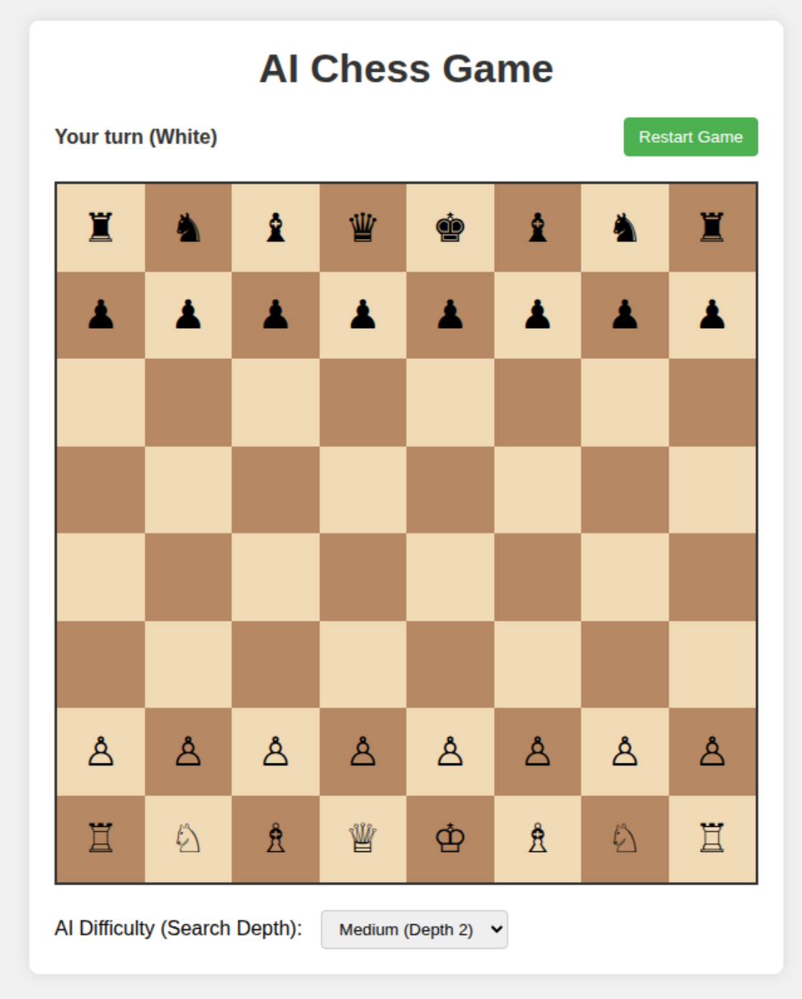

# ♟️ AI Chess Game

A classic chess game implementation where you can play against an AI opponent that uses the Minimax algorithm with Alpha-Beta pruning. This implementation provides a complete chess experience with full movement rules and an intelligent opponent that adapts to different difficulty levels.

## 🚀 How to Run

1. Open the `index.html` file in any modern web browser (Chrome, Firefox, Edge, Safari, etc.)
2. No server setup is required - the game runs entirely in the browser
3. The game works offline once loaded, so no internet connection is required for gameplay

## 📋 Prerequisites

- No software installation required
- No external libraries or frameworks needed
- Works with any modern web browser with JavaScript enabled
- Minimum screen resolution of 800x600 recommended for optimal viewing

## 🎮 How to Play

1. **Setup**: The game starts with you playing as White (bottom pieces) and the AI playing as Black (top pieces).

2. **Making Moves**:
   - Click on a piece to select it - valid moves will be highlighted
   - Click on a highlighted square to move your piece there
   - The AI will automatically respond with its move

3. **Game Controls**:
   - Use the "Restart Game" button to reset the board and start a new game
   
4. **Difficulty Settings**:
   - Select from three difficulty levels in the dropdown menu:
     - Easy: AI looks 1 move ahead
     - Medium: AI looks 2 moves ahead
     - Hard: AI looks 3 moves ahead
   - Higher difficulty means the AI spends more time thinking but plays stronger moves

5. **Special Rules**:
   - All standard chess rules are implemented including:
     - Castling
     - Pawn promotion (automatically to queen)
     - Check and checkmate detection

6. **Game End**:
   - The game ends when either player is in checkmate
   - A status message will indicate the winner

## 🧠 AI Algorithm

This chess game uses the **Minimax algorithm with Alpha-Beta pruning** for the AI opponent:

- **Minimax**: A recursive algorithm that simulates all possible moves several turns ahead, assuming both players play optimally. It creates a game tree where each node represents a possible board state, and evaluates these positions to find the optimal move.
  
- **Alpha-Beta Pruning**: An optimization technique that reduces the number of nodes evaluated in the search tree. It stops evaluating a move when it determines that the move is worse than a previously examined move, significantly improving computational efficiency.

- **Evaluation Function**: The AI evaluates board positions based on:
  - Material advantage (piece values: pawn=10, knight=30, bishop=30, rook=50, queen=90, king=900)
  - A small random factor to prevent repetitive moves
  - The evaluation focuses primarily on material balance, which is effective for beginner to intermediate players

- **Search Depth**: Configurable from 1-3 moves ahead, with deeper searches providing stronger but slower play
  - Depth 1: Evaluates immediate captures and threats
  - Depth 2: Considers opponent responses and basic tactics
  - Depth 3: Enables more complex tactical planning

The AI always tries to maximize its advantage while assuming the human player will make the best possible moves in response. This creates a challenging opponent that helps players improve their tactical awareness and planning skills.