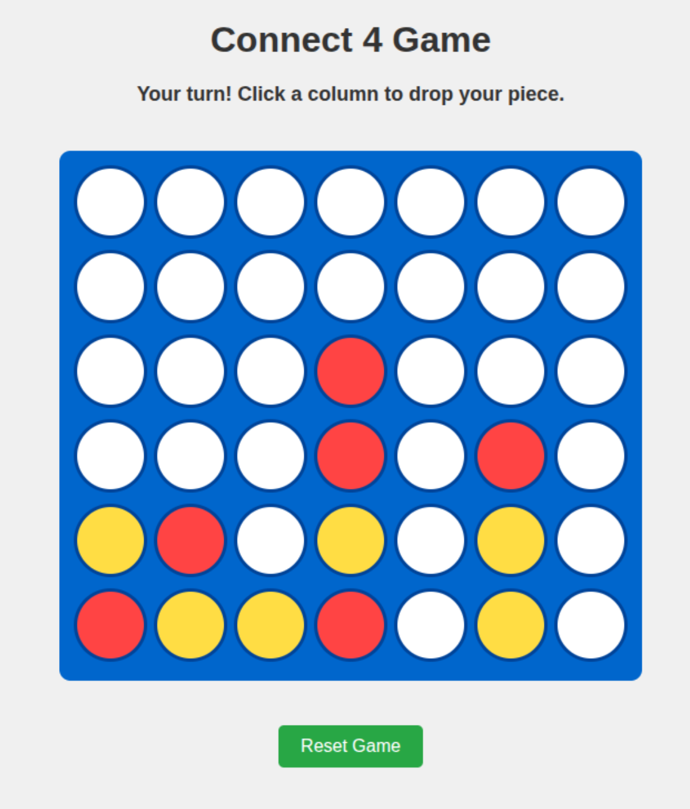

# 🔴 Connect Four Game

A classic Connect Four implementation where you play against an AI opponent with a simple strategic algorithm. This two-player strategy game challenges you to be the first to form a line of four tokens on a 6x7 grid, requiring both tactical thinking and forward planning.

## 🚀 How to Run

1. Open the `index.html` file in any modern web browser (Chrome, Firefox, Edge, Safari, etc.)
2. No server setup is required - the game runs entirely in the browser
3. The game loads instantly and can be played immediately without any configuration

## 📋 Prerequisites

- No software installation required
- No external libraries or frameworks needed
- Works with any modern web browser with JavaScript enabled
- Touch screen compatible for mobile play

## 🎮 How to Play

1. **Objective**: Connect four of your pieces (red) in a row - horizontally, vertically, or diagonally - before the computer (yellow) does the same.

2. **Making Moves**:
   - Click on any column to drop your piece
   - Your piece will fall to the lowest available position in that column
   - The computer will automatically take its turn after you
   - Strategy tip: Try to create multiple threats simultaneously to force the computer into difficult choices

3. **Game Controls**:
   - Use the "Reset Game" button to start a new game at any time
   - The game keeps track of the current player with status messages

4. **Game End Conditions**:
   - You win when you connect four red pieces in a line
   - Computer wins when it connects four yellow pieces in a line
   - The game ends in a tie if the board fills up with no winner
   - The winning line is visually indicated when the game ends

## 🧠 AI Algorithm

The Connect Four AI uses a **simple heuristic-based algorithm** with the following strategy priorities:

1. **Winning Move**: If the AI can connect four in a row with its next move, it will make that move

2. **Blocking Move**: If the player is about to connect four in a row, the AI will place its piece to block that connection

3. **Random Move**: If neither of the above conditions are met, the AI selects a random valid column
   - This introduces an element of unpredictability to keep the game interesting
   - It also prevents the AI from following the exact same pattern in every game

This creates a computer opponent that:
- Makes obvious winning moves
- Prevents obvious losing situations
- Provides an appropriate challenge level for casual players
- Doesn't require extensive computational resources
- Responds quickly even on lower-powered devices

The AI does not use deep game tree analysis or complex pattern recognition, making it suitable for beginners while still providing a reasonable challenge. This approach was chosen to create a fun opponent that occasionally makes mistakes, allowing players of all skill levels to enjoy the game.