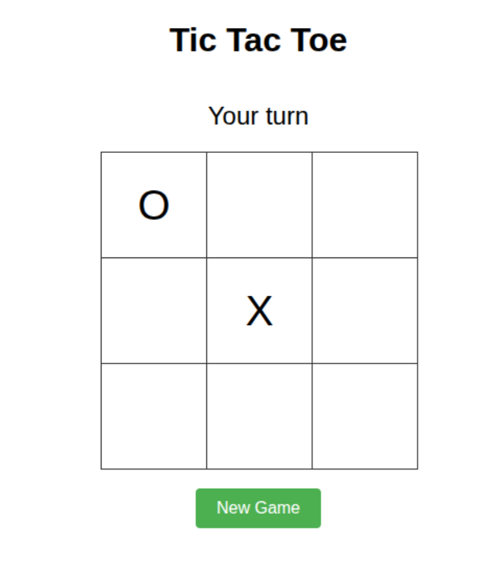

# ⭕ Tic-Tac-Toe Game

A classic Tic-Tac-Toe implementation featuring an unbeatable AI opponent using the Minimax algorithm. Despite its simple rules and 3x3 grid, this implementation demonstrates how artificial intelligence can solve games through exhaustive analysis of the game tree.

## 🚀 How to Run

1. Open the `index.html` file in any modern web browser (Chrome, Firefox, Edge, Safari, etc.)
2. No server setup is required - the game runs entirely in the browser
3. The game launches immediately and is ready to play within seconds

## 📋 Prerequisites

- No software installation required
- No external libraries or frameworks needed
- Works with any modern web browser with JavaScript enabled
- Extremely lightweight, runs smoothly on any device

## 🎮 How to Play

1. **Objective**: Get three of your symbols (X) in a row - horizontally, vertically, or diagonally - before the computer (O) does the same.

2. **Making Moves**:
   - You play as X and the computer plays as O
   - Click on any empty cell to place your X
   - The computer will automatically take its turn after you place your X
   - Strategic tip: Try to control the center and corners for the best chances of forcing a draw

3. **Game Controls**:
   - Use the "New Game" button to reset the board and start a new game at any time
   - The game status message updates to show whose turn it is or the game result

4. **Game End Conditions**:
   - You win by getting three Xs in a row
   - Computer wins by getting three Os in a row
   - The game ends in a draw if all cells are filled with no winner
   - The game announces the result with a status message

## 🧠 AI Algorithm

This Tic-Tac-Toe game implements the **Minimax algorithm**, a decision-making algorithm used for finding the optimal move:

- **Perfect Play**: The AI is essentially unbeatable - it will always win if possible, or force a draw if it can't win

- **How It Works**:
  1. The algorithm explores all possible future game states
  2. It assigns scores to each potential outcome:
     - +10 for computer win
     - -10 for human win
     - 0 for draw
  3. The AI chooses the move that maximizes its score assuming the human player will make optimal moves

- **Depth Considerations**: The algorithm also considers the depth of the game tree, preferring:
  - Quicker wins (fewer moves)
  - Slower losses (more moves)
  - This creates more natural and efficient play

- **Full Game Tree Analysis**: Due to Tic-Tac-Toe's small game tree (approximately 255,168 possible game states), the AI can analyze the complete decision tree in real-time.

- **Optimal Decision Making**: The algorithm always finds the mathematically perfect move, making it a great demonstration of how simple games can be "solved" by computers.

This creates an AI opponent that plays perfect Tic-Tac-Toe, making it impossible to win unless the player makes no mistakes. At best, a skilled player can force a draw against this AI. This implementation serves as an excellent educational tool for understanding fundamental concepts in game theory and artificial intelligence.